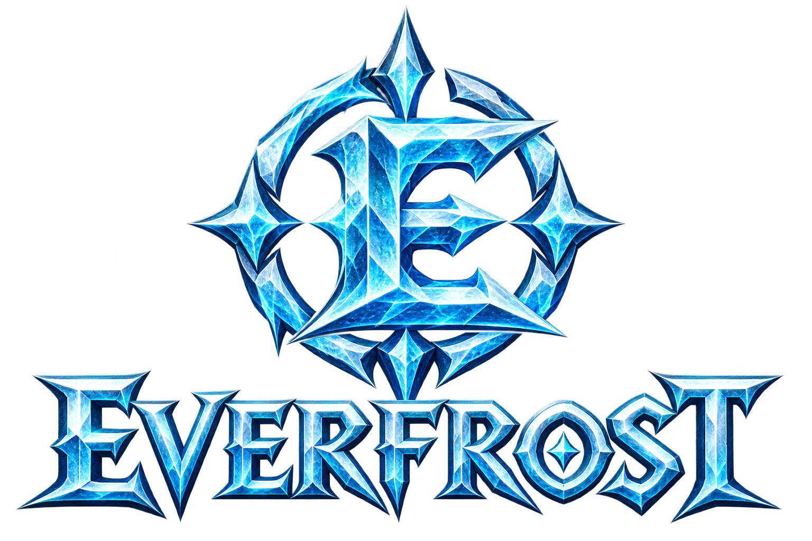

# Everfrost

<p align="center">
  
</p>

**Find your class rhythm. Forever.**

Everfrost is a lightweight, standalone Lua addon for **WoW Forever**. It displays a compact, class-aware ability reference for **levels 1–30**, with profiles for all **nine classes and 27 talent trees**. Recommendations are informed by Icy Veins Forever guides and filtered against the spells your character has actually learned.

**Written with OpenAI Codex.** The project uses Codex for AI-assisted development, review, and documentation. Automated validation uses a simulated client; actual Forever client testing is still outstanding.

[CurseForge](https://www.curseforge.com/wow/addons/everfrost) · [Download v0.4.0](https://github.com/mckenna654/Everfrost/releases/tag/v0.4.0) · [Report an issue](https://github.com/mckenna654/Everfrost/issues) · [Guide sources](addon/Everfrost/SOURCES.md)

The initial CurseForge submission is a **v0.4.0 beta** for WoW Forever **1.60.1**, pending moderation. Third-party addon-manager distribution is enabled. GitHub releases remain available while CurseForge reviews the project.

## Project status

| Item | Current status |
| --- | --- |
| Addon version | **0.4.0** |
| Supported levels | **1–30** |
| Class coverage | Nine classes, 27 talent trees, and nine general leveling profiles |
| Target interface | `16001` — compatibility with the actual Forever client remains unverified |
| Runtime | Lua 5.1-compatible syntax; no third-party addon libraries required |
| Validation | Lua syntax checks and mocked-client regression tests |
| In-game verification | Outstanding, including rendering, API behavior, and saved-setting persistence |

Everfrost is an independent project. It is not an official Icy Veins, Blizzard, or OpenAI addon and is not affiliated with or endorsed by those organizations.

## What Everfrost does

- Detects your class, level, and dominant talent tree, with a manual specialization override.
- Displays learned abilities using the trained ranks found in your spellbook.
- Provides concise hover guidance for openers, maintenance effects, fillers, and situational abilities.
- Offers single-target and AoE views, healing and damage views, and dedicated Feral and Survival role controls.
- Shows native cooldown sweeps when the client supports cooldown duration objects.
- Saves panel position, scale, visibility, mode, and specialization preferences per character.
- Refreshes spellbook and talent metadata outside combat, deferring changes until combat ends when necessary.

### A reference panel, not a next-cast engine

Read the icons from left to right, continuing on the next row, and use the hover conditions to decide which abilities apply. The list is not an instruction to cast every icon in sequence.

Everfrost does not evaluate combat resources, proc buffs, target health, enemy counts, positioning, or your current shapeshift form to choose a next cast. It does not cast abilities for you. Conditions such as choosing a seal, spending combo points, or reacting to a proc remain the player's responsibility.

## Installation

1. Download **`Everfrost-0.4.0.zip`** from the [v0.4.0 release](https://github.com/mckenna654/Everfrost/releases/tag/v0.4.0).
2. Exit WoW Forever.
3. Extract the archive's `Everfrost` folder into your Forever client's `Interface/AddOns` directory.
4. Confirm the resulting path is `Interface/AddOns/Everfrost/Everfrost.toc`.
5. Enable **Everfrost** in the AddOns list, log in, and type `/everfrost`.

Use the release asset for installation. GitHub's automatically generated source archives contain the development project; when using those, copy only `addon/Everfrost` into `Interface/AddOns`.

### Upgrading from earlier names

Earlier iterations were named **ForeverRetHelper** and **ForeverGuide**. Remove those old addon folders before enabling Everfrost to avoid duplicate panels. The current addon uses `Everfrost`, `EverfrostDB`, and `/everfrost`; settings from the previous identities are not migrated. `/fguide` and `/frh` remain command aliases.

## Using the panel

The header displays your specialization, class, level, and detection status. Hover an ability to see its spell tooltip and usage guidance. Hover the header for general profile notes. Drag the header to move the panel, or lock it with `/everfrost lock`.

| Control | Behavior |
| --- | --- |
| **SINGLE / AOE** | Switches the encounter reference mode manually |
| **HEAL / DAMAGE** | Changes the view for healing specializations; healing is the default |
| **CAT / BEAR** | Selects the Feral reference; before Cat Form is learned, Bear or caster guidance is used as available |
| **RANGED / MELEE** | Changes the Survival reference; melee requires level 30 and learned Strider Kick |

Survival defaults to the ranged approach before its melee requirements are met. At level 30 with Strider Kick learned, it defaults to melee unless you explicitly select ranged. Its melee guidance also assumes the supporting talents described in the linked guide.

### Specialization detection

Automatic detection selects the talent tree with the most points. A tie displays **HYBRID** and uses the general leveling profile; no spent points displays **UNSPENT**. If talent-point APIs are unavailable, the client specialization API is used when available.

Use `/everfrost spec 1`, `/everfrost spec 2`, or `/everfrost spec 3` to select a tree in talent-window order. Use `/everfrost spec auto` to restore automatic detection.

### Class coverage

| Class | Talent trees |
| --- | --- |
| Druid | Balance, Feral, Restoration |
| Hunter | Beast Mastery, Marksmanship, Survival |
| Mage | Arcane, Fire, Frost |
| Paladin | Holy, Protection, Retribution |
| Priest | Discipline, Holy, Shadow |
| Rogue | Assassination, Combat, Subtlety |
| Shaman | Elemental, Enhancement, Restoration |
| Warlock | Affliction, Demonology, Destruction |
| Warrior | Arms, Fury, Protection |

Several specializations share early-level priorities until their distinct abilities become available. Reaching a level does not itself add an ability to the panel: it must also be learned. Characters above level 30 receive a scope notice.

## Commands

| Command | Action |
| --- | --- |
| `/everfrost` or `/everfrost show` | Show the panel |
| `/everfrost hide` | Hide the panel |
| `/everfrost single` / `/everfrost aoe` | Set encounter mode |
| `/everfrost heal` / `/everfrost damage` | Set the healing-specialization view |
| `/everfrost cat` / `/everfrost bear` | Set the Feral view |
| `/everfrost ranged` / `/everfrost melee` | Set the Survival view, subject to melee requirements |
| `/everfrost spec auto` | Restore automatic talent-tree detection |
| `/everfrost spec 1`, `2`, or `3` | Select a talent tree manually |
| `/everfrost lock` / `/everfrost unlock` | Lock or unlock panel dragging |
| `/everfrost scale 1.2` | Set scale; accepted range is `0.6`–`2` |
| `/everfrost reset` | Reset position and scale, and show the panel |
| `/everfrost refresh` | Refresh cached metadata outside combat |
| `/everfrost source` | Print the current profile's guide URL |
| `/everfrost status` | Print class, tree, level, detection status, and any scan error |
| `/everfrost help` | Display command help |

`reset` resets the panel's position, scale, and visibility; it does not clear all preferences.

## Development

The source of truth is **`addon/Everfrost`**. The addon runs independently of Node.js; Node dependencies are used only by the development test harness.

### Set up and test

Install Node.js with npm, then run:

```sh
git clone https://github.com/mckenna654/Everfrost.git
cd Everfrost
npm ci
npm test
```

The harness parses all three Lua files as Lua 5.1 using `luaparse`, then executes regression checks with `fengari`. Coverage includes class/spec profiles, selected level boundaries, learned-rank filtering, talent API variants, combat deferral, role and encounter controls, and Survival's level-30 transition.

These tests simulate client APIs. A passing result does not prove compatibility with the Forever client, correct visual layout, or real secret-value handling.

### Package the addon

The current packaging command requires **Windows PowerShell**, available as `powershell`:

```powershell
npm run build
```

It creates `dist/Everfrost-0.4.0.zip`, containing only the installable `Everfrost` folder. It does not install the addon or publish a release. On macOS and Linux, tests can run with Node.js, but the existing build command requires an appropriate PowerShell environment; packaging is not currently cross-platform.

When releasing a new version, update `addon/Everfrost/Everfrost.toc` and `package.json` together, keep lockfile metadata synchronized, run the tests, and verify the archive contents before uploading.

### Repository layout

```text
addon/Everfrost/
  Everfrost.toc       Addon metadata and Lua load order
  Profiles.lua       Class/spec reference data and row filtering
  Core.lua           Talent detection and learned-spell scanning
  Main.lua           Panel, event handling, settings, and commands
  README.md          Packaged user instructions
  SOURCES.md         Guide links and source-review notes
  VALIDATION.txt     Recorded validation and limitations
scripts/build.ps1    Windows PowerShell packaging script
tests/check.cjs      Syntax and simulated-client regression checks
docs/HANDOFF.md      Project history and outstanding in-game checks
AGENTS.md            Codex project instructions
```

### Contribution guidelines

Keep the interface compact and preserve learned-spell-aware recommendations, Lua 5.1 compatibility, and the existing addon identifiers. Review current Icy Veins Forever guides before changing rotation content, and retain source links. Cache spellbook and talent metadata outside combat; do not compare or branch on secret combat values. Pass cooldown duration objects directly to native widgets.

Run `npm test` after Lua behavior changes. Include the relevant class, specialization, level, and learned-spell scenario when describing a fix. Report simulated tests and actual client testing separately.

## Known limitations and troubleshooting

- **Client compatibility is unverified.** The TOC targets interface `16001`; actual API behavior and rendering need in-game checks.
- **English guidance.** Existing spells use localized names where mappings are available. New Forever-specific spell names currently require an English spellbook.
- **Guide content is manually maintained.** Some source pages retain older level-20 wording. The recorded Arcane review used indexed excerpts because the full page was inaccessible.
- **Manual combat conditions.** Talent build details, gear, weapon setup, proc conditions, and encounter context must be checked by the player.
- **Spellbook API dependence.** Missing or incomplete client metadata can leave abilities absent from the panel.

If a learned ability is missing, leave combat and run `/everfrost refresh`. Check that the selected role, encounter mode, specialization, and level are appropriate. For an issue report, include:

- Addon version and Forever client build.
- Class, level, talent tree, and relevant learned spell/rank.
- Output from `/everfrost status`.
- Expected behavior, observed behavior, and reproduction steps.
- Any Lua error and, for layout issues, a screenshot.

Before treating a build as game-tested, verify login and trained icons, training and respec updates, level thresholds, role/AoE controls, cooldown sweeps, dragging, and persistence after reload or logout. Repeat on another class.

## License

Everfrost is licensed under the [MIT License](LICENSE). The same license is selected on CurseForge.

## Sources and acknowledgments

Ability references are concise adaptations of the **Icy Veins WoW Forever PvE guides**. The [source index](addon/Everfrost/SOURCES.md) preserves all 27 guide links, API references, and review notes. Use `/everfrost source` to find the guide associated with the active profile.

Everfrost was written with **OpenAI Codex**. See the [development handoff](docs/HANDOFF.md) for the project's evolution from ForeverRetHelper and ForeverGuide to Everfrost v0.4.0.
